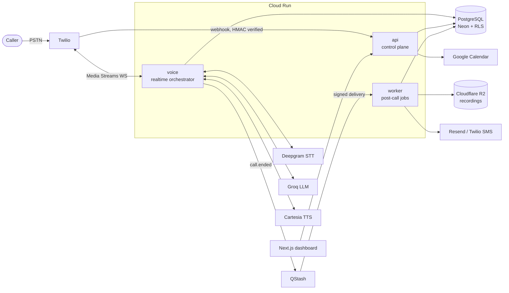
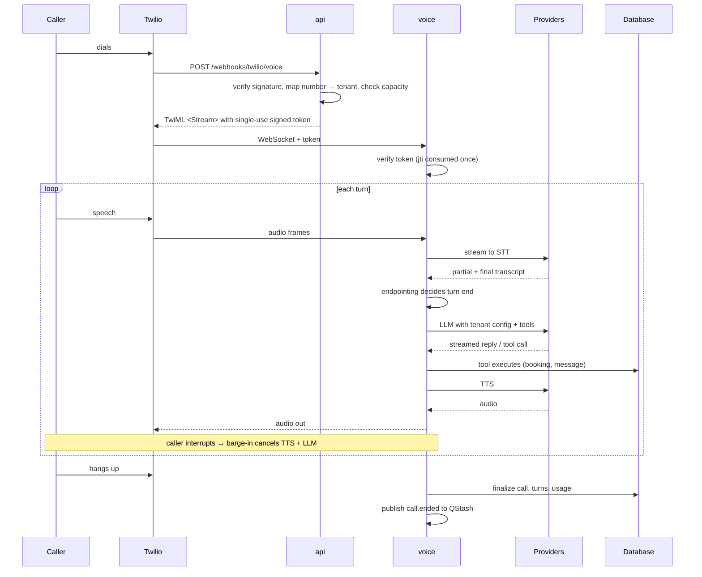
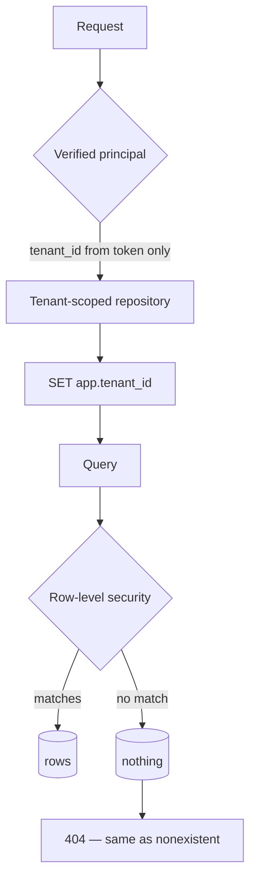
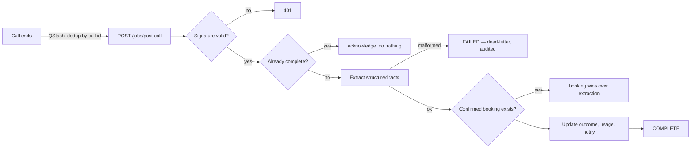

# AI Voice Receptionist Platform

A multi-tenant AI receptionist that answers the phone for home-services
businesses — plumbers, electricians, HVAC engineers — when they can't.
It holds a spoken conversation, books against a real calendar, takes
messages, and puts genuine emergencies straight through to a human.

> **Status: built and internally verified; not yet run against real
> providers or a real phone call.** See
> [PRODUCTION_READINESS.md](PRODUCTION_READINESS.md) for the honest
> account of what is proven and what is not. No customers, no revenue,
> and no real call metrics are claimed anywhere in this repository.

## See it work in 30 seconds

No credentials, no database, no network:

```bash
uv sync --all-packages && uv run python demo.py
```

Six turns through the **real** conversation engine, state machine, and
guardrail pipeline — only the model and audio are mocked. The model is
deliberately scripted to misbehave: it tries to invent a price, grant a
discount, obey an injected instruction, and confirm a booking that never
happened.

```
   Caller          How much to unblock a drain?
   Model wanted    It's just $49 flat, and I can throw in a free inspection.
   Guardrail       price_invention -> rewritten
   Receptionist    BLOCKED The team will confirm the exact price after reviewing the job.
```

Five of six turns get stopped. That is the thing this project is
actually about: **the model proposes, and something deterministic
decides.**

---

## The problem

When a pipe bursts, people ring down a list until someone picks up. A
tradesperson on a job misses the call, and the work goes to whoever
answered. Voicemail does not fix it — callers with an urgent problem
hang up rather than leave a message.

The hard part is not answering. It is answering *safely*: never quoting
a price the business did not approve, never confirming a slot the
calendar does not have, and never treating a gas leak as a routine
message.

## What it does

- **Answers every call** in the business's name, day or night
- **Books appointments** against real Google Calendar availability
- **Takes structured messages** with name, number, address, and problem
- **Escalates emergencies** to a human immediately
- **Refuses to invent** prices, services, hours, or availability
- **Isolates tenants** at two independent layers

---

## Architecture



**Services split by failure domain.** The voice path must never be taken
down by a dashboard deploy, and a stalled post-call job must never
affect a live call. Each scales on its own axis: voice on concurrent
calls, api on request rate, worker on queue depth.

### Stack

| Layer | Choice | Why |
|---|---|---|
| Services | Python 3.12, FastAPI, Cloud Run | Async-native; scale-to-zero |
| Database | PostgreSQL (Neon) + Alembic | Row-level security, branching |
| Dashboard | Next.js 16, Tailwind v4 | Server components keep tokens server-side |
| Telephony | Twilio Media Streams | Bidirectional audio over WebSocket |
| Speech | Deepgram (STT), Cartesia (TTS) | Streaming both directions |
| LLM | Groq | Latency is the product |
| Jobs | Upstash QStash | Signed, at-least-once, bounded retries |
| Auth | Clerk | Organisations map to tenants |

---

## Call lifecycle



Detail: [docs/call-lifecycle.md](docs/call-lifecycle.md).

---

## Safety

The receptionist speaks on behalf of a real business. Four mechanisms
stop it saying something that business would not.

**Guardrails.** A pipeline inspects every reply before it is spoken:
price invention, service invention, and availability invention are
blocked and rewritten into a deflection.
[docs/guardrails.md](docs/guardrails.md)

**A closed tool set.** Six tools, strict schemas. Availability comes from
the calendar; prices come from approved rows. There is no path from the
model to a fact the tenant did not provide.

**A deterministic state machine.** 22 states with a guarded transition
table. The model chooses what to say; the machine decides what may
happen next.

**No premature confirmation.** A booking is announced only after the
caller agreed *and* the write succeeded. This is enforced in code and
asserted as a safety-critical evaluation case.

### Booking safety

```mermaid
sequenceDiagram
    participant E as Engine
    participant DB as Database
    participant Cal as Calendar

    E->>DB: SAVEPOINT; INSERT booking (unique idempotency_key)
    alt key already exists
        DB-->>E: existing booking
        E-->>E: report the original — never a second row
    else new
        DB-->>E: pending booking
        E->>Cal: create event
        alt calendar succeeds
            E->>DB: status = confirmed
            E-->>E: only now may the receptionist say "booked"
        else calendar fails
            E->>DB: status = reconciliation_required
            E-->>E: take a message; never claim a booking
        end
    end
```

A real-database test races four concurrent transactions on one key and
asserts exactly one booking exists.
[docs/booking-safety.md](docs/booking-safety.md)

### Tenant isolation



Two independent layers. No client endpoint reads a tenant id from a
path, query, or body. A cross-tenant id returns **404, not 403** —
a 403 confirms the row exists. [docs/tenant-isolation.md](docs/tenant-isolation.md)

### Endpointing and barge-in

Knowing when a caller has *finished* is most of what makes a voice agent
feel human. A multi-signal engine combines silence duration, energy,
punctuation, hesitation markers, and semantic completeness — with an
injectable clock so the behaviour is unit-testable.
[docs/endpointing.md](docs/endpointing.md)

When a caller talks over the reply, the platform cancels TTS and the LLM
stream, clears buffered audio at Twilio, and records how much the caller
actually heard — so the conversation resumes from what they heard, not
what was generated. [docs/barge-in.md](docs/barge-in.md)

---

## Evaluation

64 version-controlled cases across 32 scenarios — normal bookings,
emergencies, angry callers, silence, prompt injection, cross-tenant
probing, and every provider failure mode.

Twelve assertion families cover required and forbidden tools, tool
order, outcome, database state, escalation correctness, latency, and the
two that matter most: no unapproved price, and no premature
confirmation.

```bash
uv run python -m ai_evals.cli --require-coverage
```

Exit **2** means a safety property regressed; **1** is a quality
failure. CI gates on both, separately. Every assertion has a
deliberately-broken negative test, because an assertion that never fires
looks exactly like one that always passes.
[docs/evaluation.md](docs/evaluation.md)

---

## Post-call processing



Idempotent by call: a redelivered job acknowledges instead of
re-processing. A committed booking is never downgraded by the model's
reading of the transcript.

---

## Running it

### Locally — no cloud credentials needed

Every provider sits behind a Protocol with a mock, so the whole suite
runs offline.

```bash
uv sync --all-packages
```

```bash
uv run pytest -q
```

Tests needing PostgreSQL skip cleanly when none is reachable. For the
full suite:

```bash
docker run -d --name receptionist-test-pg -e POSTGRES_PASSWORD=test -e POSTGRES_DB=receptionist_test -p 55432:5432 postgres:16-alpine
```

Dashboard:

```bash
cd apps/dashboard && npm install && npm run dev
```

### Quality gate

```bash
uv run ruff check . && uv run ruff format --check . && uv run mypy packages services demo.py && uv run pytest -q
```

mypy runs in strict mode across every package and service.

### Staging and production

Staging deploys automatically on merge to `main` after CI. Production is
manual and tagged — the gap between "tests pass" and "customers' calls
depend on it" should need a human decision.

Migrations never run by hand: `infra/scripts/migrate.sh` verifies a
single head and that every migration reverses or declares why it cannot,
then rehearses the round-trip on a Neon branch cloned from production.

[docs/deployment.md](docs/deployment.md) ·
[docs/rollback.md](docs/rollback.md)

---

## Monitoring and security

Alerts are evaluated from database state rather than in-process
counters, so "are calls failing now" answers identically on every
replica. Twelve alerts each carry a threshold, a window, and a runbook,
and tests enforce that every declared alert is actually evaluated.
[docs/monitoring.md](docs/monitoring.md)

Sensitive fields are AES-256-GCM encrypted with keyed lookup hashes for
search. Recordings live in R2 behind 15-minute signed URLs, audited per
access, deleted on a retention schedule. Log redaction and Sentry
scrubbing run at the processor level rather than per call site.
[docs/security.md](docs/security.md) · [docs/privacy.md](docs/privacy.md)

---

## Limitations

Stated plainly, with the scale at which each stops being acceptable:

- **Six concurrent calls** platform-wide. Fine for the first clients;
  raise `maxScale` before the fifth tenant.
- **Rate limiting is per instance.** Correct at one or two instances,
  wrong at ten.
- **No encryption key rotation.** Ciphertext is versioned so it can be
  added, but no re-encryption migration exists yet.
- **English only.**
- **Evaluation cases are scripted**, so they pin known behaviour and
  cannot discover an unimagined failure mode.
- **No automated frontend tests** — the dashboard is covered by
  typechecking, build, and the API tests behind it.

## Roadmap

1. **Prove the voice path.** Real providers, real calls, real measured
   latency. Everything else is secondary until this is done.
2. Outbound follow-up calls for unconfirmed bookings
3. Redis-backed rate limiting and a shared metrics store
4. Encryption key rotation with a re-encryption migration
5. Additional languages
6. Self-serve onboarding — currently deliberately human-assisted

---

## Documentation

| | |
|---|---|
| [PRODUCTION_READINESS.md](PRODUCTION_READINESS.md) | What is verified vs merely built |
| [delivery/](delivery/README.md) | **Client-facing handover pack** — send as-is |
| [docs/system-architecture.md](docs/system-architecture.md) | Full architecture |
| [docs/database.md](docs/database.md) | Schema and data model |
| [docs/call-lifecycle.md](docs/call-lifecycle.md) | A call, end to end |
| [docs/guardrails.md](docs/guardrails.md) | How invention is prevented |
| [docs/booking-safety.md](docs/booking-safety.md) | Idempotency and transactions |
| [docs/tenant-isolation.md](docs/tenant-isolation.md) | The isolation contract |
| [docs/endpointing.md](docs/endpointing.md) · [docs/barge-in.md](docs/barge-in.md) | Turn-taking |
| [docs/provider-failures.md](docs/provider-failures.md) | Degradation ladder |
| [docs/evaluation.md](docs/evaluation.md) | The eval harness |
| [docs/security.md](docs/security.md) · [docs/privacy.md](docs/privacy.md) | Security and privacy |
| [docs/monitoring.md](docs/monitoring.md) | Metrics and alerts |
| [docs/deployment.md](docs/deployment.md) · [docs/rollback.md](docs/rollback.md) | Shipping |
| [docs/client-onboarding.md](docs/client-onboarding.md) · [docs/support.md](docs/support.md) | Operations |
| [docs/incident-response.md](docs/incident-response.md) | When it breaks |
