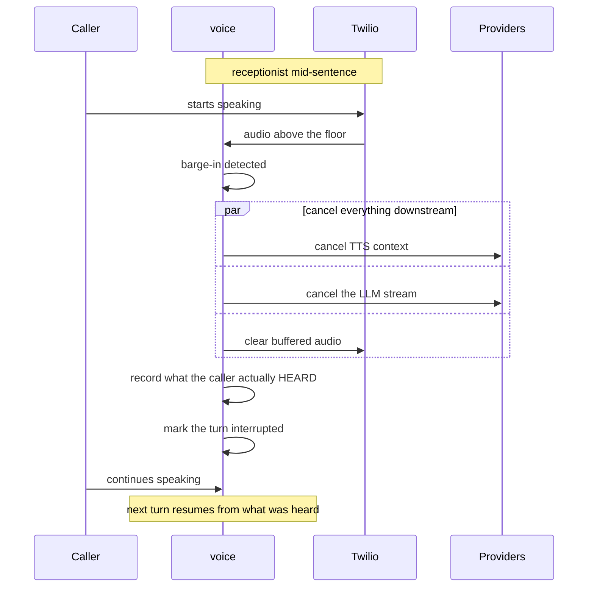

# Barge-in

Real people interrupt. If the receptionist keeps talking over a caller
who has started speaking, the call stops being a conversation — and
callers hang up on systems that will not listen.

## What has to happen

An interruption is not one action. Four things must happen quickly, and
a fifth matters more than the others.

## The part that is easy to get wrong

**Cancelling generation is not enough.** Twilio has already buffered
audio; without an explicit clear the caller keeps hearing a sentence the
system has abandoned.

**And the caller heard a prefix, not the whole thing.** If the
receptionist generated "We have Tuesday at ten, Wednesday at two, or
Thursday morning" and was cut off after "Tuesday at ten", the caller
knows about one slot. Treating the full text as spoken produces the
maddening failure where the system says "as I mentioned" about something
nobody heard.

So `PlaybackRecord` tracks **generated** text and **played** text
separately, estimating the heard portion from playback duration at
roughly 15 characters per second. Conversation history records what was
heard, not what was produced.

## Sentence chunking

Replies are synthesised in sentence-sized chunks rather than as one
block. Two reasons: the first words start playing sooner, and an
interruption discards less work while giving a much better estimate of
what was heard.

`MIN_CHUNK_CHARS` sets a floor so a short clause is not split into
unnaturally clipped fragments.

## Fillers

While the LLM is still thinking, a short filler ("let me check that")
keeps the line alive. Fillers are:

- **Rotated**, so the same phrase is not repeated in one call
- **Capped**, because two in a row sounds broken
- **Disableable** per tenant

Silence is worse than a filler, but a filler every turn is worse than
silence.

## Measured

`SpeechController` records stop time — detection to audio actually
stopping. That is the number that determines whether an interruption
feels responsive, so it is worth watching once real calls exist.

## Honest limitation

Barge-in has never interrupted a real human over a real phone line. The
logic is tested, including cancellation, buffer clearing, and heard-
portion estimation; the *feel* is unverified. The 15-characters-per-
second estimate in particular is an approximation that real calls should
correct.
