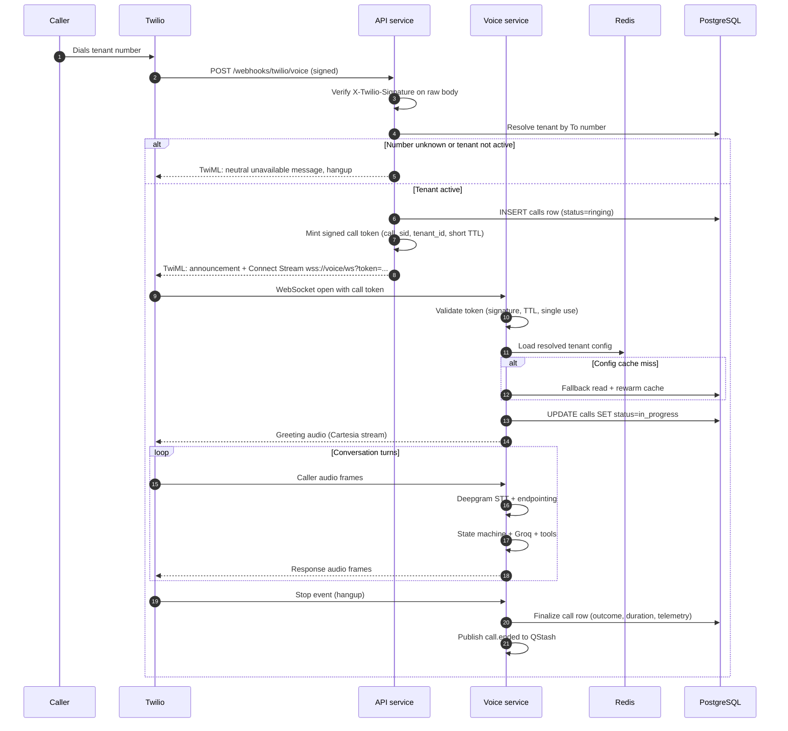
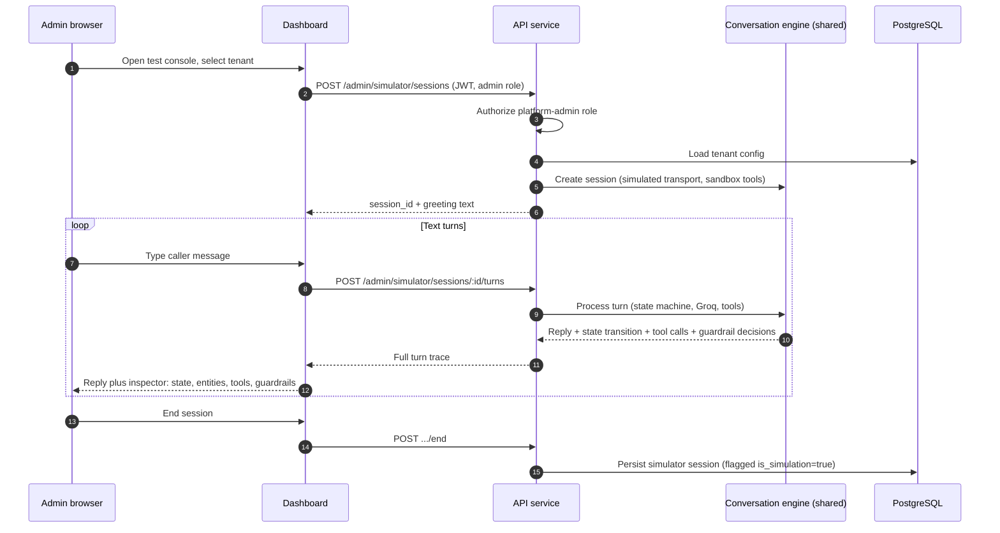
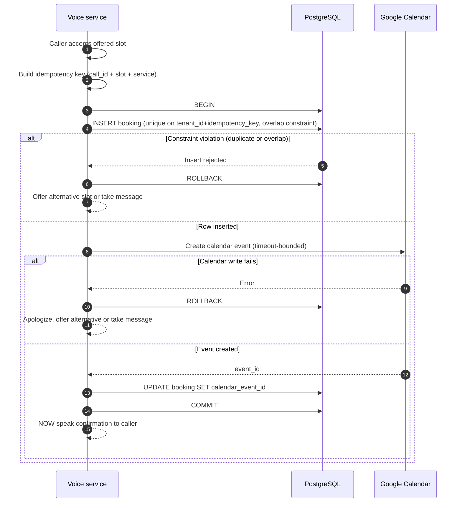
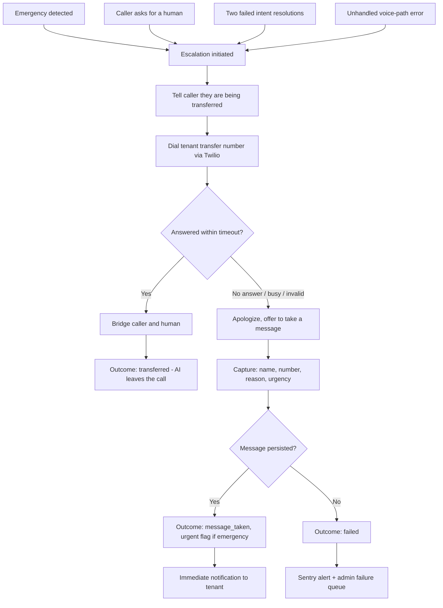
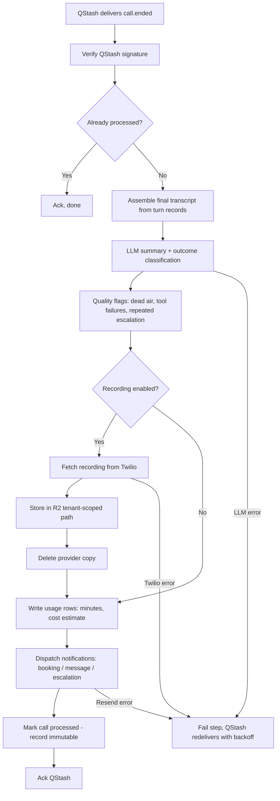

# Call Lifecycle

**Related:** [System architecture](system-architecture.md) · [Security boundaries](security-boundaries.md)

This document traces every path a conversation can take through the platform: the inbound phone call, the browser test call, the booking transaction, the human-transfer fallback, and post-call processing.

---

## 1. Inbound call flow

**Turn loop detail** — within each turn:

1. Inbound µ-law frames stream to Deepgram; interim transcripts accumulate.
2. Endpointing signals end of caller turn (semantic endpoint + silence threshold).
3. The state machine assembles a bounded context: system prompt, tenant facts, conversation state, recent turns, older-turn summary.
4. Groq generates either a short spoken response or a tool call. Tool calls execute with hard timeouts; if a tool exceeds ~400 ms a filler phrase covers the wait.
5. Response text streams to Cartesia; audio chunks stream to Twilio as they arrive — no stage buffers a complete payload before forwarding.
6. If the caller speaks during playback (barge-in): TTS is cancelled, the Twilio buffer is cleared, and the new utterance becomes the active turn.
7. Turn record (text, tool calls, per-stage latency) is queued for async persistence — the write never blocks audio.

---

## 2. Browser test-call flow

The simulator runs the **identical** conversation engine — state machine, tools, guardrails — with text I/O replacing audio and telephony.

**Sandboxing rules:** simulator sessions are marked `is_simulation` and excluded from usage, notifications, and client dashboards. Booking tools run in dry-run mode against live calendars unless the admin explicitly enables real writes for an end-to-end test. Saved sessions become regression scenarios for the evaluation harness.

---

## 3. Booking transaction

The invariant: **the caller hears a confirmation only after both the database row and the calendar event exist.**

**Race handling:** two concurrent callers targeting the same slot are serialized by the database overlap constraint — exactly one insert succeeds; the loser's transaction rolls back and that caller is offered the next slot. The calendar is treated as a replica of the bookings table, not the authority. A committed booking whose calendar write later proves inconsistent is repaired by the worker's reconciliation sweep, in favour of the database.

**Idempotency:** replaying the same booking request (retry, duplicate tool call) hits the unique key and returns the existing booking rather than creating a second one.

---

## 4. Human-transfer fallback

Every escalation path converges on the same ladder: **transfer → message → alert.** No call ends in silence.

Emergency escalations skip pleasantries: the transfer is announced and dialled immediately, and the notification fires even when the transfer succeeds.

---

## 5. Post-call processing

Triggered by `call.ended` on QStash. At-least-once delivery; every step is idempotent on `call_id`.

A step that fails after QStash's retry budget lands in the dead-letter queue and the admin failure review; the call record remains available with whatever stages completed. Reconciliation sweeps (scheduled via QStash) catch calls stuck in `in_progress`, orphaned provider recordings, and undelivered notifications.

---

## 6. Call outcomes

Every call terminates in exactly one outcome, set by the voice service (or reconciliation, for crashed calls):

| Outcome | Meaning | Triggers notification |
|---|---|---|
| `booked` | Booking committed and confirmed | Yes — booking confirmation |
| `message_taken` | Structured message persisted | Yes — message alert (urgent variant for emergencies) |
| `transferred` | Human bridge succeeded | Only if emergency-flagged |
| `answered_inquiry` | Question answered from tenant data, no follow-up needed | No |
| `caller_hangup` | Caller left before an outcome | No |
| `failed` | Application/provider failure ended the call | Admin alert |
