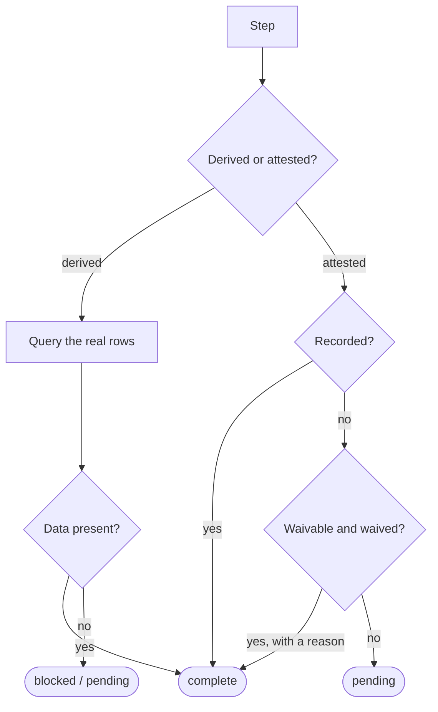

# Client onboarding

How a business goes from signed to answering. The forms and scripts are
in [client-launch.md](client-launch.md); this is how the workflow itself
works and why it is built the way it is.

## The principle

Onboarding state is **derived from real rows wherever possible**. A step
is complete because the services, hours, or calendar connection actually
exist — not because someone ticked a box.

A checklist that can disagree with reality is worse than no checklist,
because it produces confident activation of a broken tenant. So the API
refuses to let a derived step be marked by hand.

## Derived vs attested

| Kind | Examples | How it completes |
|---|---|---|
| **Derived** | services, hours, phone number, calendar, voice, service area, prices | Automatically, when the data exists |
| **Attested** | greeting approved, escalation dialled, browser test, phone test, safety review | A human records it, with an audit entry |

Attested steps exist because nothing in the database can prove a person
heard a real call, or that the client approved the greeting wording.
Those need a name against them.

## Waivers

Two steps are waivable — the browser voice test and the real phone test
— because a number sometimes ports after the client wants to go live.

A waiver **requires a written justification**. A waiver without a reason
is just a skipped check, so the API rejects one. The reason, the actor,
and the timestamp appear on the activation report, which is the point:
the decision is visible later, when someone asks why the phone test was
never run.

## The seventeen steps

Business information · owner invitation · phone number · greeting ·
recording notice · services · prices · business hours · service area ·
escalation · calendar · voice · browser text test · browser voice test ·
real phone test · safety review · activation.

Activation is separate and gated: it re-checks readiness server-side
regardless of what the dashboard claimed, so a blocker cannot be
bypassed by a stale page.

## Generated reports

Three, all derived from the same state:

**Handover checklist** — what the receptionist will do, and explicitly
what it will *not* do. The limits section is the most valuable part: a
client who knows it will refuse to quote an unapproved price is not
surprised when it does.

**Test call report** — every test, its result (passed, waived, or never
run), who signed it off, and any note. "Never run" is shown rather than
hidden.

**Activation report** — the record of why this tenant was judged safe:
outstanding blockers, every step's status, and every waiver with its
reason.

## Onboarding the second tenant

Steps are data. Adding a tenant is configuration — new rows, new
approvals, the same workflow. No code changes, which is asserted by a
test so it stays true.

## Where it lives

`/admin/tenants/{id}/onboarding` in the admin console: every step with
its live status, blockers listed separately, sign-off and waiver
controls on attested steps only, and links to the three reports.
