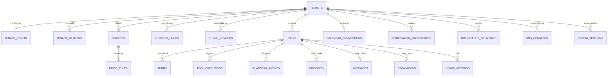

# Database

PostgreSQL on Neon, accessed through async SQLAlchemy, migrated with
Alembic.

## Conventions

- **UUID primary keys**, generated client-side, so a row is addressable
  before flush.
- **All timestamps `TIMESTAMPTZ`**, always UTC.
- **Every tenant-owned table carries `tenant_id`** with an index, plus
  composite indexes covering the dashboard's dominant queries.
- **Native enum types**, append-only. Adding a value is a migration;
  PostgreSQL cannot remove one, which is why the enum-extension
  migration is marked `IRREVERSIBLE:`.
- **Money is integer cents.** Never a float.
- **Sensitive values encrypted** at the application layer, with
  `*_hash` for keyed lookup and `*_last_four` for display.

## Cascade policy

This is the design decision most worth understanding:

| Relationship | On delete | Why |
|---|---|---|
| Tenant → configuration, services, hours | `CASCADE` | Configuration is meaningless without its tenant |
| Tenant → calls, usage, audit | `RESTRICT` | History must never vanish by accident |
| Call → turns, tool executions | `CASCADE` | Meaningless without the call |
| Call → bookings, messages | `SET NULL` | The commitment outlives the call record |

Deleting a tenant is a soft archive (`archived_at`). A hard purge is an
explicit, audited procedure — `RESTRICT` makes accidental destruction
impossible rather than merely discouraged.

`SET NULL` on bookings matters: a customer's appointment is a real
commitment that must survive its call record being purged.

## Entity map

## Table groups

**Identity** — `tenants`, `tenant_members`. Clerk organisations map to
tenants; membership status gates access, so revoking is a status change
rather than a deploy.

**Configuration** — `tenant_config`, `services`, `price_rules`,
`business_hours`, `holiday_overrides`, `config_versions`. Changes go
through draft → review → active with rollback, so a bad configuration is
reversible without a database restore.

**Calls** — `calls`, `turns`, `tool_executions`, `guardrail_events`.
Per-turn latency lives on `turns`, which is what the p50/p95 metrics and
the latency alert read.

**Outcomes** — `bookings`, `messages`, `escalations`. `bookings` carries
the globally unique `idempotency_key` that makes double-booking
impossible.

**Operations** — `usage_records`, `audit_logs`, `provider_events`,
`notification_deliveries`, `notification_preferences`, `sms_consents`,
`email_suppressions`.

## Row-level security

Every tenant-owned table has RLS `ENABLE`d and `FORCE`d, keyed on
`app.tenant_id`. `FORCE` is the important half — without it the table
owner bypasses the policy, and the application connects as the owner.
See [tenant-isolation.md](tenant-isolation.md).

## Encryption

| Column pattern | Contents |
|---|---|
| `*_encrypted` | AES-256-GCM ciphertext, versioned `v1:` |
| `*_hash` | Keyed HMAC-SHA256, for equality search |
| `*_last_four` | Display fragment |

Encrypted: caller numbers, customer names in free text, addresses,
message bodies, internal notes, OAuth tokens.

The version prefix exists so a future key can coexist with old rows.
**No re-encryption migration exists yet**, so rotating the data key today
would make every encrypted column permanently unreadable — see
[secret-rotation.md](secret-rotation.md).

## Migrations

Ten migrations, single head. `infra/scripts/migrate.sh verify` enforces
that in CI, along with the rule that every migration either reverses or
declares `IRREVERSIBLE:` with a reason.

Forward changes are **expand-and-contract**: add, backfill, write both,
switch reads, stop writing, drop. A migration requiring code and schema
to change together cannot be rolled back independently, and so cannot be
rolled back at all.
