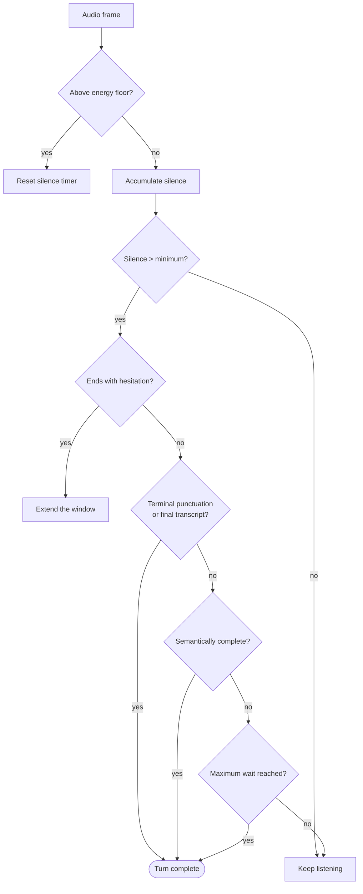

# Endpointing

Knowing when a caller has **finished speaking** is most of what makes a
voice agent feel human. Get it wrong in one direction and you interrupt
someone mid-thought; wrong in the other and every reply arrives a beat
too late, which callers read as the system not working.

A fixed silence threshold cannot win. 500ms cuts off anyone who pauses
to think; 1500ms makes every exchange feel sluggish.

## Multiple signals

The engine combines evidence rather than trusting one timer.

| Signal | Suggests finished | Suggests still talking |
|---|---|---|
| Silence duration | Longer | Shorter |
| Audio energy | Below the µ-law floor | Above it |
| Final transcript | Received | Only partials |
| Terminal punctuation | `.` `?` `!` | Trailing clause |
| Hesitation markers | Absent | "um", "er", "and", "so" |
| Semantic completeness | A complete request | A dangling fragment |
| Utterance length | Substantial | A single word |

Hesitation markers matter most in practice. "I need a plumber for, um…"
has a long silence *and* an obvious continuation cue. A silence-only
detector interrupts; this one waits.

A maximum wait always fires. A caller who trails off without finishing
still gets a response — a system that waits forever is worse than one
that answers slightly early.

## Configuration

Thresholds live in `EndpointingConfig` rather than as constants, because
the right values differ by deployment: a noisy van needs a higher energy
floor than an office.

## Testability

The engine takes an **injectable clock**. Timing behaviour is unit-tested
deterministically — no `sleep`, no flakes — which is why silence,
hesitation, and maximum-wait paths all have direct tests rather than
being verified by ear.

`EndpointingMetrics` records what fired and after how long, so real calls
can be used to tune thresholds against evidence instead of intuition.

## Interaction with barge-in

Endpointing decides when the caller *stopped*. [Barge-in](barge-in.md)
decides what happens when they start again while the receptionist is
still talking. Both must be right for a conversation to feel natural;
either alone is not enough.

## Honest limitation

These thresholds have never been tuned against real speech over a real
phone line. They are principled defaults, tested for logic, not
calibrated. Week two of the launch plan exists specifically to fix that
with fifty real calls.
