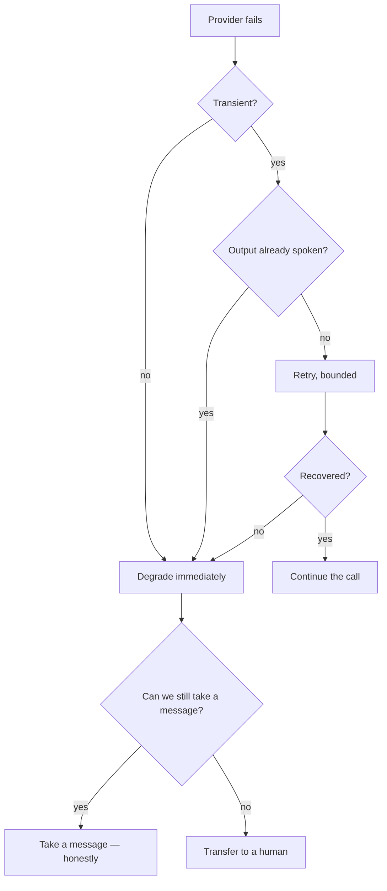

# Provider failures

Six external services sit in the call path. Something is always
degrading somewhere, and the caller must never hear it as silence or as
a lie.

## The taxonomy

Every adapter maps vendor-specific failures onto one hierarchy, so
callers branch on semantics rather than on a vendor's error codes:

| Error | Transient | Meaning |
|---|---|---|
| `ProviderTimeoutError` | yes | No response in budget |
| `ProviderUnavailableError` | yes | Refused, 5xx, stream dropped |
| `ProviderRateLimitError` | yes | Throttled |
| `ProviderAuthError` | **no** | Bad credentials — retrying cannot help |
| `CredentialRevokedError` | **no** | Tenant revoked access; needs a human |
| `ProviderResponseError` | **no** | Unparseable; fail closed, never guess |
| `DuplicateSendError` | no | Idempotency key reused; the original stands |

The transient flag drives retry decisions. Retrying an auth error just
delays the inevitable while a caller waits.

## Degradation ladder

**Retry only before the caller has heard anything.** Once a sentence has
started playing, retrying produces a different second half — worse than
a clean degradation.

## Per-provider behaviour

**Groq (LLM).** Bounded retries inside one turn while no output has been
emitted; the final attempt uses a smaller fallback model. Exhausted →
take a message.

**Deepgram (STT).** The session reconnects. Audio during the gap is
lost, so the receptionist asks the caller to repeat rather than guessing
at a partial transcript.

**Cartesia (TTS).** A failure mid-sentence cancels the context and the
turn is re-synthesised or degraded. Silence is the enemy: an honest
"sorry, could you say that again" beats dead air.

**Twilio.** Webhook failures are Twilio's retries, made safe by
idempotent CallSid handling. A dropped media socket ends the call and
finalises the record — the call still appears in the dashboard with what
happened.

**Google Calendar.** Timeout or revocation means **no booking is
claimed**. The receptionist takes a message. This is the case most
likely to tempt a system into inventing availability, so it is a
safety-critical evaluation case in two variants.

**Resend / Twilio SMS.** Notification failure never fails the call or
the post-call job — the data is already durable. The delivery row
records the failure category for the dashboard, and transient failures
stay retryable behind the same idempotency key.

## What the caller hears

The whole point:

| Failure | Caller experience |
|---|---|
| LLM slow | "Bear with me one moment" — then either recovery or a message |
| STT gap | "Sorry, could you say that again?" |
| TTS failure | Brief pause, then a retry or a message |
| Calendar down | "I can't reach the calendar, so I'll take a message and someone will confirm" |
| Transfer unanswered | "Nobody's picking up, so I've taken a message" |
| Everything down | Twilio's own voicemail fallback |

Notice what is absent: no invented time, no claimed booking, no
pretending the problem did not happen.

## What is tested

Every failure mode above has an evaluation case, and the transient/
terminal distinction is covered by provider contract tests shared across
mock and real adapters — so a new provider cannot quietly change the
error semantics the call path depends on.
