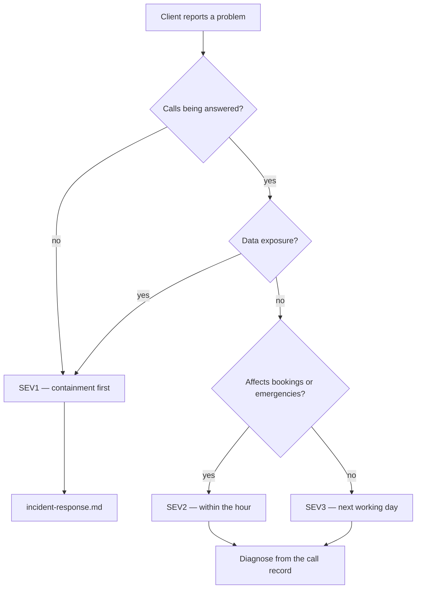

# Support

How clients get help, and how we answer. Written for a one-person
operation, so it promises what one person can actually deliver.

## What we promise

One channel, agreed at launch. Realistic commitments:

| Kind | Response |
|---|---|
| "It's not answering calls" | Within the hour, business hours |
| Something is wrong with a call | Same working day |
| Configuration change | Two working days |
| Question | Two working days |

**Do not promise 24/7.** One person cannot deliver it, and a missed
promise costs more trust than a modest one kept. If out-of-hours cover
is needed later, it becomes a real rota, not an aspiration.

## Triage

Start from what the caller experienced, not from the logs.

Severity definitions and containment steps live in
[incident-response.md](incident-response.md).

## Common requests

**"It didn't book someone in."** Open the call. The transcript, tool
executions, and guardrail events show exactly what happened. Usually one
of: the calendar was unreachable (correct behaviour — it took a message
instead), the service was not configured, or the caller was out of area.

**"It wouldn't give a price."** Almost always correct behaviour: the
price is not approved. Fix by approving the price, not by loosening the
guardrail.

**"It said something wrong."** Get the call id. Check guardrail events
first — if a firewall fired, the system behaved correctly and the
configuration is incomplete. If nothing fired and the reply was genuinely
wrong, that is a defect: add an evaluation case before fixing it.

**"I want to change my prices/hours/services."** Configuration change
through the approval workflow, versioned and rollback-able.

**"Cancel this booking."** The client can, from their dashboard. Remind
them it does **not** contact the customer.

## Configuration changes

Never edited live. Draft → review → approve → active, with rollback. The
version history answers "what did it say last Tuesday" months later.

Price changes deserve particular care: the receptionist can only quote
approved prices, so an unapproved change silently makes it refuse to
quote at all — which looks like a fault and is not.

## What we do not support

Being clear about this prevents disappointment:

- Outbound calling — inbound only
- Languages other than English
- Custom integrations beyond Google Calendar
- Changing what the receptionist says mid-call
- Recovering recordings deleted by retention
- Unsending a notification

## Escalating to the client

Some things need them, not us:

- Nobody answering transfers — the platform escalated correctly
- Their calendar disconnected — only they can reconnect it
- Callers asking for services they do not offer — a business decision
- Repeated out-of-area calls — possibly their service area is wrong

The monthly report's "questions it could not answer" section surfaces
most of these, which is why it is the most useful part of the report.

## Feeding fixes back

Every defect that reaches a client should produce:

1. An evaluation case that fails before the fix
2. The fix
3. A note in the monthly report if the client was affected

The suite exists so the same failure cannot return quietly.
