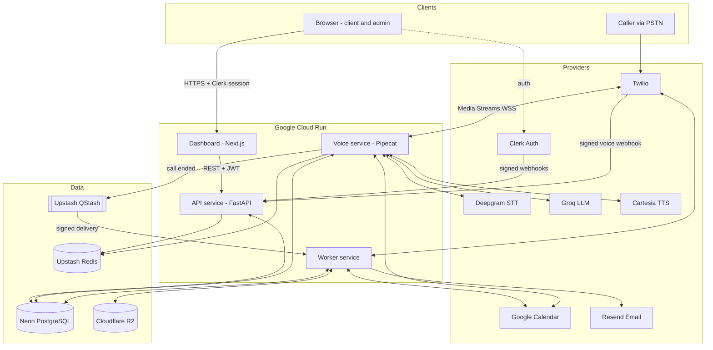
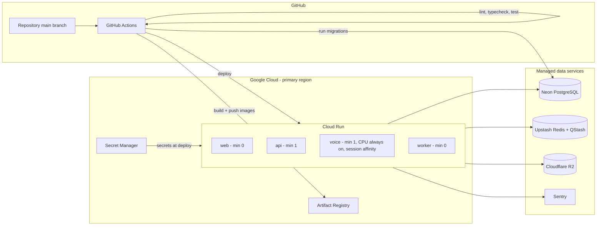
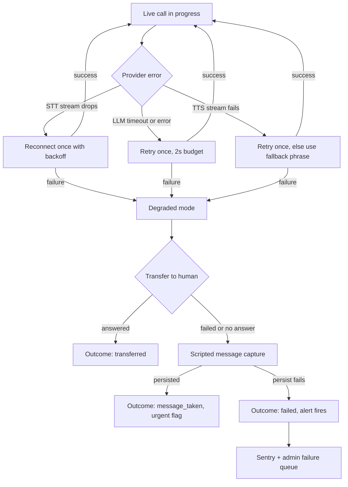

# System Architecture

**Related:** [Architecture baseline](architecture/00-assessment.md) · [Product requirements](product-requirements.md) · [Call lifecycle](call-lifecycle.md) · [Security boundaries](security-boundaries.md)

The platform is a modular monolith split into four deployable services along one hard boundary: *code that runs while a caller is waiting for audio* is isolated from everything else. This document defines each service, how they communicate, and how the system is deployed.

---

## 1. Services

### 1.1 Dashboard (`apps/dashboard`)

Next.js application serving both client users and platform administrators.

**Responsibilities**

- Client interface: overview, calls, bookings, messages, usage, staff management
- Platform-admin interface: tenant management, number assignment, failure review, reports
- Authentication-aware routing: Clerk session handling, org-based tenant context, role-gated route groups
- Configuration forms: validated with Zod, submitted to the API service
- Call review: transcript display, recording playback via signed URLs
- Usage reporting: per-tenant metrics and CSV export triggers
- Browser-based test console: admin-only UI over the API's simulator endpoints

**Explicitly not responsible for:** business logic, direct database access, authorization decisions (it renders what the API permits; the API enforces).

### 1.2 API service (`services/api`)

FastAPI control plane. The only service that writes configuration and owns the schema.

**Responsibilities**

- Authenticated REST APIs for all dashboard data
- Tenant management: lifecycle, provisioning, activation checklist
- Business configuration: services, prices, hours, service area, persona, escalation rules
- Call queries, booking queries, message queries, usage queries
- Integration management: Google Calendar OAuth flow, connection health
- Provider webhooks not requiring persistent media sessions: Twilio voice webhook (returns TwiML), Twilio status callbacks, Clerk user/org events
- Issuing short-lived call tokens that authorize a media WebSocket to the voice service
- Publishing resolved tenant config to Redis on every configuration change

### 1.3 Voice service (`services/voice`)

Pipecat-based realtime orchestrator. One process holds one WebSocket per live call.

**Responsibilities**

- Twilio Media Streams WebSocket termination and audio framing (µ-law 8 kHz)
- STT streaming to Deepgram with interim results
- End-of-turn detection: endpointing signals + silence heuristics
- Conversation state machine: intent, entities, failure counters, escalation triggers
- LLM generation via Groq with a bounded context window
- Tool execution: availability, booking, message, escalation, business-info tools
- TTS streaming from Cartesia, chunked back to Twilio
- Interruption handling: barge-in detection, playback cancellation, buffer flush
- Call-time telemetry: per-stage latency per turn, tool timings
- Error fallback: any unhandled error → transfer attempt → message capture

### 1.4 Worker service (`services/worker`)

Async post-call processor, invoked by QStash over signed HTTP.

**Responsibilities**

- Post-call extraction: final transcript assembly, entity consolidation
- Summaries: LLM-generated call summary and outcome classification
- Notification delivery: booking/message/escalation emails via Resend, with retry
- Usage aggregation: per-tenant, per-month counters and cost estimates
- Recording cleanup: fetch from Twilio → store in R2 tenant path → delete provider copy
- Retry processing: QStash redelivery handling, idempotent by `call_id`
- Reconciliation: scheduled sweeps for stuck calls, orphaned recordings, missed notifications
- Scheduled evaluation: nightly evaluation-harness runs against staging config
- Retention enforcement: deleting recordings past each tenant's retention window

---

## 2. Overall platform architecture

---

## 3. Service communication

| Channel | Used by | Pattern | Authentication |
|---|---|---|---|
| **REST** | Dashboard → API | Request/response JSON over HTTPS; OpenAPI-typed | Clerk JWT (issuer, audience, expiry verified) |
| **REST (internal)** | Voice → API (config fallback), Worker → API (none in v1; worker reads DB directly) | JSON over HTTPS | `INTERNAL_SERVICE_TOKEN` bearer |
| **WebSocket** | Twilio → Voice | Bidirectional µ-law audio frames + control events | Single-use signed call token bound to `call_sid` + `tenant_id`, short TTL |
| **Database** | API, Voice, Worker → Neon | SQLAlchemy 2 async via asyncpg; pooled connections; repositories always tenant-scoped; RLS as backstop | TLS + credentials from Secret Manager; per-transaction `app.tenant_id` |
| **Redis** | API (write), Voice (read), all (rate limits, idempotency) | Resolved tenant config cache with TTL; live-call state; distributed locks | Upstash REST token |
| **QStash** | Voice → Worker, scheduled jobs → Worker | At-least-once signed HTTP delivery with retries and DLQ; consumers idempotent | QStash signature verification (current + next key) |
| **Provider APIs** | Voice → Deepgram/Groq/Cartesia; Worker → Twilio/Resend/Google; API → Twilio/Google | Streaming WebSocket (STT/TTS), HTTPS (rest); all behind provider interfaces with bounded retries and circuit breakers | Provider API keys from Secret Manager |
| **Signed object storage** | Worker → R2 (write), Dashboard users → R2 (read) | Recordings written to `tenants/{tenant_id}/calls/{call_id}/...`; playback via presigned URLs, ≤15 min expiry, issued by API after authorization | R2 access keys (server-side only); presigned URLs to clients |

**Rules**

- No service calls another service's database tables through anything but the shared repository layer (`packages/database`).
- No synchronous call from the voice path to the worker, ever.
- Provider responses are validated against Pydantic models before use; a malformed provider response is an error, not data.

---

## 4. Deployment architecture

**Environments:** `staging` deploys automatically on merge to `main`; `production` requires manual approval. Neon branches back preview/dev databases. Migrations run as a separate CI job *before* service deploy and must be backward-compatible with the running revision.

**Voice-service specifics:** CPU always allocated, session affinity, 60-minute request timeout, concurrency sized to ~6 calls/instance, graceful drain on redeploy (old revision finishes its calls; new revision takes new calls).

---

## 5. Provider failure handling

Circuit breakers per provider: after N consecutive failures the breaker opens and new calls go straight to degraded mode while a probe request tests recovery. Provider error rates are first-class alert metrics — an open breaker pages before clients notice.

---

## 6. Component ownership

| Concern | Owner |
|---|---|
| Database schema + migrations | API service (Alembic in `migrations/`) |
| Domain models, booking transaction | `packages/domain`, executed in-process by API/Voice/Worker |
| Repositories (tenant-scoped) | `packages/database` |
| Provider interfaces + adapters | `packages/providers` |
| Logging, request IDs, latency metrics | `packages/telemetry` |
| Conversation state machine | Voice service |
| TwiML + call tokens | API service |
| Recording lifecycle | Worker service |
| Evaluation harness | `evals/`, run by CI and Worker (scheduled) |

---

*Companion documents: [call-lifecycle.md](call-lifecycle.md) (inbound call, booking, transfer, post-call flows) and [security-boundaries.md](security-boundaries.md) (trust boundaries, isolation, authn/authz).*
