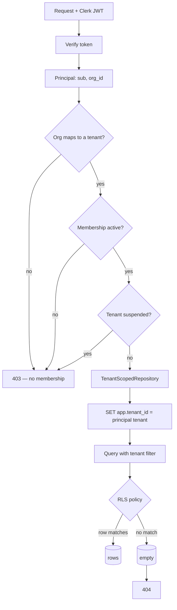

# Tenant isolation

One platform, many businesses. A tenant seeing another tenant's caller
data is the failure that ends the product, so it is defended twice with
mechanisms that fail independently.

## The contract

1. A client request's tenant comes **only** from the verified principal.
   No client endpoint accepts a tenant id in a path, query, or body.
2. Every tenant-owned table enforces row-level security keyed on the
   `app.tenant_id` GUC.
3. A cross-tenant identifier returns **404**, never 403.

The third point is deliberate. A 403 says "this exists but is not
yours", which confirms a record's existence to someone who should not
know. 404 is indistinguishable from nonexistent.



## Layer one — application scoping

`TenantScopedRepository` fixes its tenant at construction from the
principal. `get_owned(Model, id)` adds the filter; a call site cannot
forget it because there is no unscoped variant to reach for.

Admin endpoints are the *only* place a tenant is selected by id, and
they sit behind `require_platform_admin`, which 404s for everyone else —
so the admin surface is invisible rather than merely forbidden.

## Layer two — row-level security

Every tenant-owned table has:

```sql
ALTER TABLE <table> ENABLE ROW LEVEL SECURITY;
ALTER TABLE <table> FORCE ROW LEVEL SECURITY;
CREATE POLICY <table>_tenant_isolation ON <table>
  USING (tenant_id = current_setting('app.tenant_id', true)::uuid);
```

`FORCE` matters: without it the table owner bypasses the policy, and the
application connects as the owner.

This layer exists because layer one is code, and code has bugs. A query
that forgets its filter returns nothing rather than another tenant's
rows.

## Where it is enforced

| Surface | Mechanism |
|---|---|
| Client API | Principal-derived scope + RLS |
| Admin API | Explicit tenant id, admin-only, audited |
| Voice service | Tenant resolved from the called number, re-checked on the media socket |
| Worker | Tenant read from the call row; all writes scoped to it |
| Dashboard | Never sees a token; all calls are server-side |

## Deliberate exceptions

Three tables are intentionally not tenant-scoped, and each is a
considered decision:

- `tenants` — the tenant list itself, admin-only.
- `audit_logs` — `tenant_id` is nullable because platform-level events
  have no tenant. Client-facing reads are still filtered.
- `phone_numbers` — globally unique by number, because routing must
  resolve a number to a tenant *before* a tenant is known.

## What is tested

- Tenant A requesting tenant B's call, booking, message, or recording →
  404
- A client principal on any `/admin/*` route → 404
- Staff attempting an owner-only action → 403/404
- A suspended tenant's owner → refused at the dependency
- Cross-tenant probing through the conversation itself → refused, and
  asserted as a safety-critical evaluation case

The evaluation suite includes cross-tenant cases because isolation must
hold at the conversational layer too: a caller asking the receptionist
about another business gets nothing.
